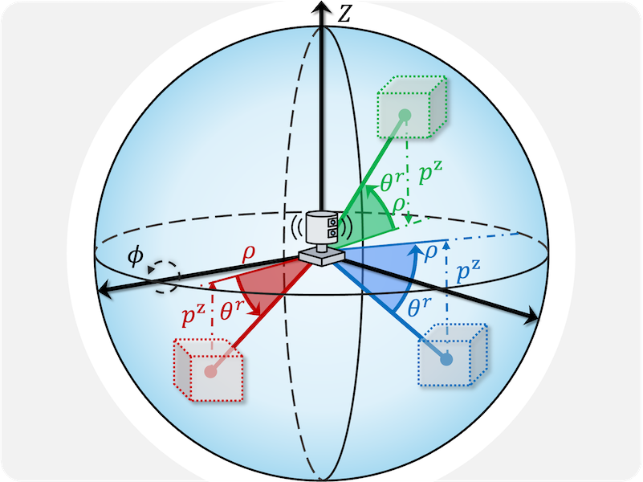
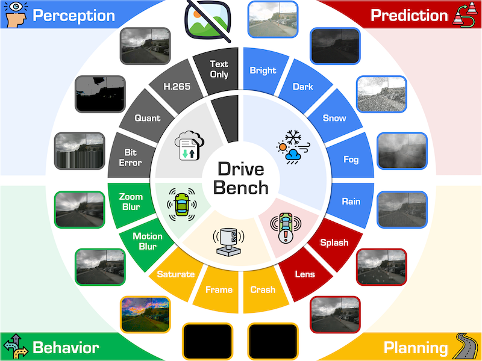

| :sunglasses: Awesome | Project |
|:-:|:-|
| |
|  | **3D and 4D World Modeling: A Survey** [[GitHub Repo](https://github.com/worldbench/survey)] - [[Project Page](https://worldbench.github.io/survey)] - [[Paper](https://huggingface.co/papers/2509.07996)] |
|  | **Benchmarking 3D and 4D World Models in the Real World** [GitHub Repo] (Coming Soon) |
|  | **LiDARCrafter: Dynamic 4D World Modeling from LiDAR Sequences** [[GitHub Repo](https://github.com/lidarcrafter/toolkit)] - [[Project Page]](https://lidarcrafter.github.io/) - [[Paper](https://arxiv.org/abs/2508.03692)] |
|  | **DynamicCity: Large-Scale 4D Occupancy Generation from Dynamic Scenes** [[GitHub Repo](https://github.com/3DTopia/DynamicCity)] - [[Project Page]](https://dynamic-city.github.io/) - [[Paper](https://arxiv.org/abs/2410.18084)] |
|  | **Perspective-Invariant 3D Object Detection** [[GitHub Repo](https://github.com/pi3det/toolkit)] - [[Project Page]](https://pi3det.github.io/) - [[Paper](https://arxiv.org/abs/2507.17665)] |
|  | **Are VLMs Ready for Autonomous Driving? A Study from Reliability, Data & Metric Perspectives** [[GitHub Repo](https://github.com/drive-bench/toolkit)] - [[Project Page]](https://drive-bench.github.io/) - [[Paper](https://arxiv.org/abs/2501.04003)] |
|  | **Vision-Language-Action Models for Autonomous Driving: Past, Present, and Future** [GitHub Repo] (Coming Soon) |
| |
